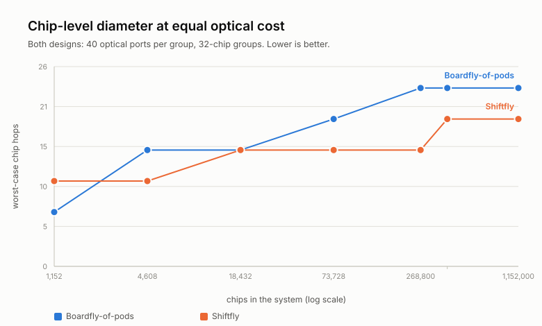
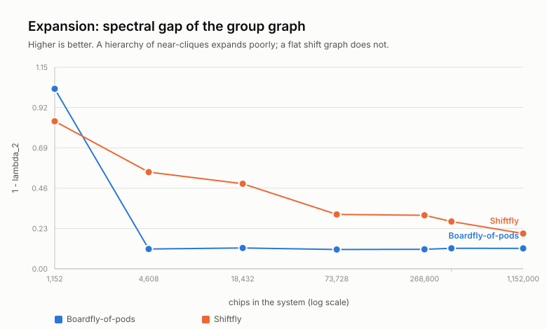
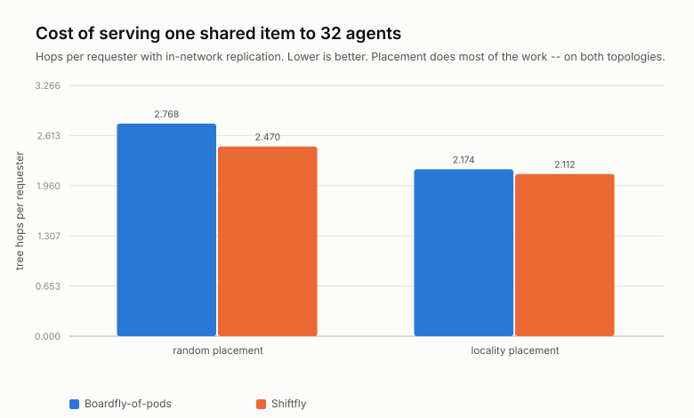

# Shiftfly

**A shift-routed interconnect for accelerator fabrics beyond pod scale.**

Google's TPU interconnect spent nine generations as a Cayley graph of an abelian
group — a $k$-ary $n$-cube whose diameter grows as $\Theta(N^{1/n})$ — before
TPU 8i replaced it with **Boardfly**, a three-tier fully-connected hierarchy of
Dragonfly type with diameter 7 over 1,152 chips.

This repository audits every shipped TPU topology against the Moore bound,
proposes a replacement for Boardfly's *global tier* that scales past one pod,
and measures both honestly. **📄 [Read the paper](paper/shiftfly.pdf)**
([source](paper/shiftfly.tex)).

```
git clone https://github.com/EylonKrause/shiftfly
cd shiftfly
python3 run_experiments.py          # stdlib only — no numpy, no matplotlib
python3 -m unittest discover -s tests
```

---

## The observation

At TPU-class radix ($\Delta \approx 7$), the Moore bound says:

| Diameter | Largest possible graph | Shipped at that diameter |
|---|---|---|
| 4 | 1,814 | — |
| 5 | 10,886 | — |
| 6 | 65,318 | — |
| **7** | **391,910** | **Boardfly: 1,152 chips** |

Boardfly spends diameter 7 on 1,152 chips, where $\Delta = 7$ would in
principle admit ~392,000. Even at its own scale it is ~1.75× off — the bound
permits diameter 4 at that order.

The bound is a ceiling that almost no graph attains, and Boardfly is buying real
things with the slack (bisection, cabling, fault tolerance). But the slack is
large enough to interrogate.

**The structural problem is sharper than the bound.** Boardfly's global tier is
a *complete* graph on groups, so reaching $G$ groups costs $G-1$ optical ports.
At 400,000 chips that is 12,499 ports against 40 available — so another
hierarchy level must be stacked, and each level costs four chip hops.

## The construction

Keep Boardfly's local structure (4-chip building block, 8 BBs → 32-chip group;
cheap copper, and it's good). Replace the complete global tier with a
**generalized Kautz digraph** over groups, installed as a fixed permutation on
the optical circuit switch that already exists.

$$K(d,D):\quad N = (d+1)d^{D-1}\ \text{vertices},\quad \text{out-degree } d,\quad \text{diameter exactly } D$$

which sits within $1+O(1/d)$ of the *directed* Moore bound. For group counts
that aren't of that form, the Imase–Itoh digraph on $\mathbb{Z}_n$ exists at
every $n$ with diameter $\le \lceil \log_d n \rceil$.

**Port accounting matters and is easy to get wrong.** In- and out-neighbourhoods
are disjoint except on a thin set, so out-degree $d$ costs $2d$ bidirectional
ports. Matching Boardfly's 40 optical ports means $d = 20$, **not** 40 —
comparing at $d=40$ silently doubles the hardware. Everything below is at
$d = 20$, and a test asserts the two designs' edge counts agree within 5%.

## Results

### Scaling — Boardfly wins at pod scale, Shiftfly wins beyond it

<picture>
  <source media="(prefers-color-scheme: dark)" srcset="figures/diameter_vs_scale_dark.svg">
  
</picture>

| Chips | Boardfly | Shiftfly |
|---|---|---|
| 1,152 | **7** | 11 |
| 4,608 | 15 | **11** |
| 18,432 | 15 | 15 |
| 73,728 | 19 | **15** |
| 268,800 | 23 | **15** |
| **400,000** | 23 | **19** |
| 1,152,000 | 23 | **19** |

At the 400,000-chip target: **23 → 19 hops, a 17% reduction at identical optical
cost.** The widest gap is 23 → 15 at 268,800 chips. Both curves are step
functions, so the advantage is not monotone — and **Boardfly is strictly better
at the scale it was designed for.** Nothing here contradicts Google's choice for
TPU 8i.

### Expansion

<picture>
  <source media="(prefers-color-scheme: dark)" srcset="figures/spectral_gap_dark.svg">
  
</picture>

Roughly **2.7× better spectral gap**, which is obvious in hindsight: a hierarchy
of near-cliques joined by few links is a poor expander whatever its diameter.

### Sharing — the mostly-negative result

The design was motivated by redundancy: agentic inference fans one query into
many rollouts that request the *same* prefixes, weights and tool results, and a
shift-routed graph makes their routes provably merge (Theorem 3 in the paper).
Measured, that motivation largely does not survive.

<picture>
  <source media="(prefers-color-scheme: dark)" srcset="figures/sharing_cost_dark.svg">
  
</picture>

| Placement | Boardfly $T$ | Shiftfly $T$ | Boardfly merge | Shiftfly merge |
|---|---|---|---|---|
| random | 2.768 | 2.470 | 2.868 | 2.772 |
| locality-aware | 2.174 | **2.112** | 2.336 | **2.152** |
| *saving from placement* | *−21.5%* | *−14.5%* | | |

Locality-aware placement removes 21.5% of tree cost on Boardfly and 14.5% on
Shiftfly. **Shiftfly's residual advantage at matched placement is 2.9%.** The
overwhelming majority of the achievable saving on shared content comes from
*placement* — which is topology-agnostic and available to Boardfly too.

**A metric trap worth stating.** Multicast *efficiency* $\eta = U/T$ is a ratio,
so it rewards a topology for placing requesters far away provided their paths
overlap. It ranks Boardfly **higher** (1.431 vs 1.364) while absolute tree cost
ranks it **lower** (2.174 vs 2.112). Reporting $\eta$ alone — the natural
reading of the objective — inverts the conclusion.

## Why the algebra is interesting anyway

- **Routing needs no tables.** For $u,v$ in $K(d,D)$, the walk
  $w^{(k)} = u_{k+1}\cdots u_D\, v_{\ell+1}\cdots v_{\ell+k}$ reaches $v$ in
  $D - \ell$ steps, where $\ell$ is the longest suffix of $u$ that is a prefix
  of $v$. The destination label *is* the route — no protocol, no convergence,
  at any scale.
- **Content addressing is native.** Hash an item to a label; that is its home
  vertex. No directory, no consistent-hashing ring. Same algebra as the Koorde DHT.
- **Merging is a theorem, not a protocol.** Routes to a common destination
  coincide at step $k$ **iff** the sources agree in their last $D-k$ symbols, so
  first merge is at $D - \mathrm{lcs}(u,u')$.
- **…but merging is not free.** With random labels
  $\mathbb{E}[\mathrm{lcs}] = 1/(d-1) \approx 0.05$ at $d=20$ — essentially no
  merging before the destination. It must be bought with a locality-aware
  labelling, and that is the co-design step whose measured value is the 2.9% above.

## Known flaws

1. **Boardfly is better at one-pod scale.** 7 vs 11 chip hops at 1,152 chips.
2. **Bisection.** de Bruijn/Kautz families have bisection $\Theta(N/\log N)$
   against $\Theta(N)$ for a complete or expander tier. Shiftfly wins against a
   *hierarchy* because hierarchies expand badly; against a flat high-radix
   fabric it would not. All-to-all-dominated workloads are the adversarial case.
3. **Cabling.** Shift edges are long and irregular — the standard reason
   de Bruijn networks aren't built. The mitigation is narrow and not general:
   the global tier is *already* optically circuit-switched, so the wiring is a
   permutation the OCS installs. This argument is available to an operator that
   owns an OCS layer and to essentially nobody else.
4. **Deterministic routing.** Shift routing gives one path. Load balance needs
   non-minimal alternatives, and randomising the route partly destroys the merge
   property. Unquantified here.
5. **The switch is mechanical.** MEMS OCS reconfigures in milliseconds to
   seconds, so the permutation is fixed at scheduling time and label assignment
   is a scheduling decision, not a runtime one.
6. **The workload model is synthetic.** Cluster count, agent fan-out, scheduler
   locality and Zipf exponent are plausible, not measured. The sharing
   conclusions are only as good as those four numbers.

## Validation

The chip-level Boardfly model is built from Google's published structure with a
stated port-assignment rule, and **measures diameter exactly 7**, matching the
published figure. That check is what makes the rest of the comparison worth
reading. 35 tests assert the paper's theorems against the code — including that
no constructed graph exceeds its own Moore bound, that every torus hits its
analytic diameter, that shift routes are valid walks within the diameter, and
that the merge criterion holds.

## Repository

| Path | Contents |
|---|---|
| [`topology/graphs.py`](topology/graphs.py) | torus, Boardfly (chip + group level), Kautz, de Bruijn, Imase–Itoh, Moore bounds |
| [`topology/metrics.py`](topology/metrics.py) | distances, spectral gap, multicast cost, shift routing, merge depth |
| [`topology/workload.py`](topology/workload.py) | the sharing model and the labelling strategies |
| [`run_experiments.py`](run_experiments.py) | regenerates every figure and table |
| [`results/results.md`](results/results.md) | **the table view** — every number behind every figure |
| [`tests/test_topology.py`](tests/test_topology.py) | 35 invariants, including the paper's theorems |
| [`paper/shiftfly.tex`](paper/shiftfly.tex) | the write-up, with proofs |

## Prior art

Kautz digraphs are near-optimal for the directed degree–diameter problem and
have been since 1968; arbitrary-order generalizations are due to Reddy, Pradhan
& Kuhl (1980) and Imase & Itoh (1981); Dragonfly (Kim, Dally, Scott & Abts,
2008) established the form Boardfly follows; Slim Fly, PolarFly and Bundlefly
pursue the degree–diameter frontier at *router* radix. **None of the graph
theory here is new.** The contribution is the argument that this family is the
right global tier for an accelerator fabric that already owns a reconfigurable
optical switch — plus an honest measurement of what that buys and what it
doesn't.

---

A personal study by [Eylon Krause](https://github.com/EylonKrause). MIT licensed.
All TPU figures are from public announcements and press; pod shapes for v5p, v7
and v8t are inferred from published chip counts and marked as such. No
proprietary information is used anywhere in this repository.
